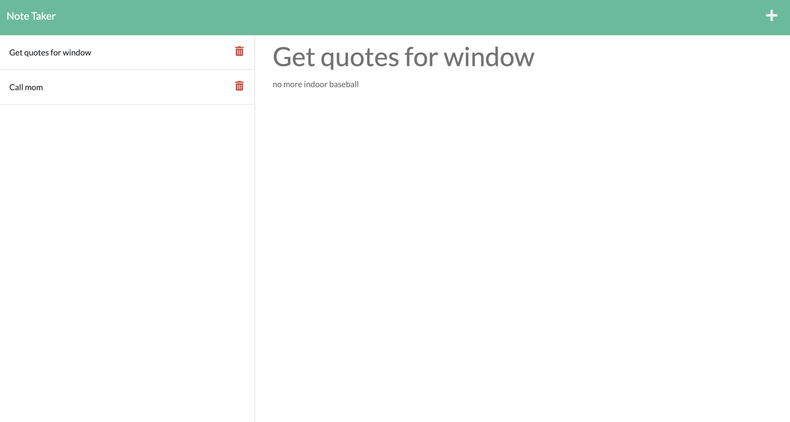

# Challenge_11_Express_Note_Taker
An Express.js app that allows you to save and edit notes.  This application is deployed live to Glitch. [Deployed Note Taker App ](https://purple-shore-throne.glitch.me)

# Table of Contents 

* [Technology used](#Technology%20used)
* [Installation](#Installation)
* [Usage](#Usage)
* [License](#License)

# Technology used

* HTML
* CSS
* Node
* Express.js
* npm
* JavaScript
* Node File System 
* Node UUID
* Bootstrap
* Glitch

# Installation 

From the command line change directory to where you cloned this repo to then type 'npm install express fs util uuid', then to run it type 'node server.js'

You can view the live deployed app on Glitch here [Deployed App ](https://purple-shore-throne.glitch.me)

# License
MIT License

Copyright (c) 2022 illtron3030

Permission is hereby granted, free of charge, to any person obtaining a copy 
of this software and associated documentation files (the "Software"), to deal
in the Software without restriction, including without limitation the rights
to use, copy, modify, merge, publish, distribute, sublicense, and/or sell
copies of the Software, and to permit persons to whom the Software is
furnished to do so, subject to the following conditions:

The above copyright notice and this permission notice shall be included in all
copies or substantial portions of the Software.

THE SOFTWARE IS PROVIDED "AS IS", WITHOUT WARRANTY OF ANY KIND, EXPRESS OR
IMPLIED, INCLUDING BUT NOT LIMITED TO THE WARRANTIES OF MERCHANTABILITY,
FITNESS FOR A PARTICULAR PURPOSE AND NONINFRINGEMENT. IN NO EVENT SHALL THE
AUTHORS OR COPYRIGHT HOLDERS BE LIABLE FOR ANY CLAIM, DAMAGES OR OTHER
LIABILITY, WHETHER IN AN ACTION OF CONTRACT, TORT OR OTHERWISE, ARISING FROM,
OUT OF OR IN CONNECTION WITH THE SOFTWARE OR THE USE OR OTHER DEALINGS IN THE
SOFTWARE.

